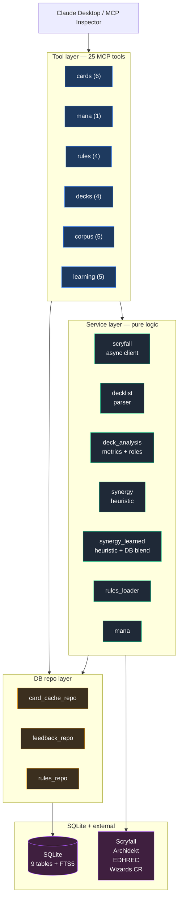
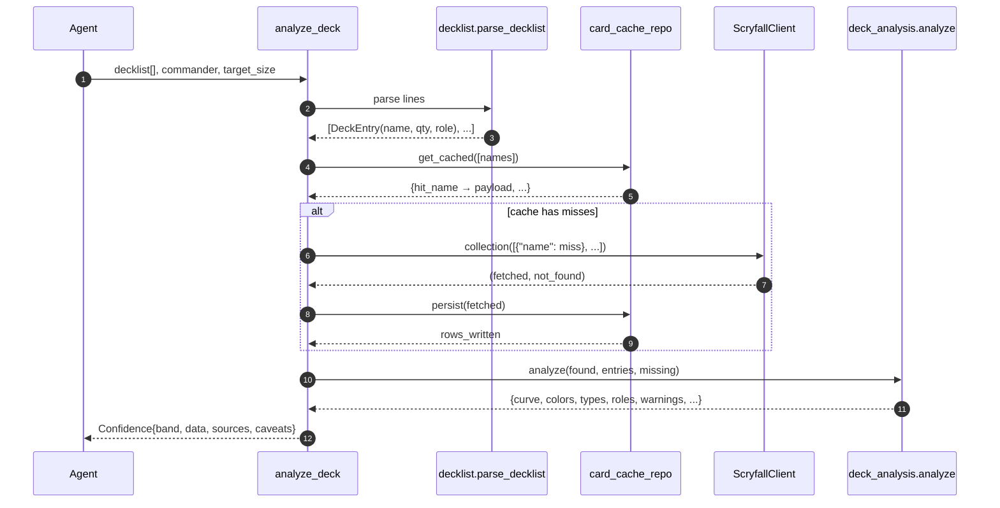
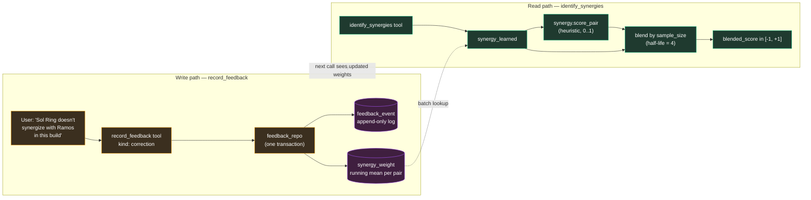
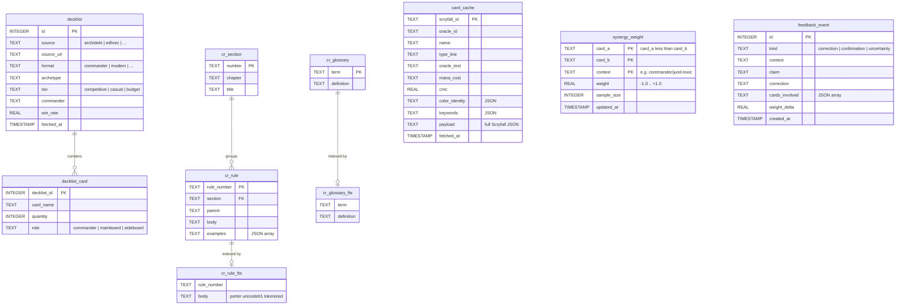
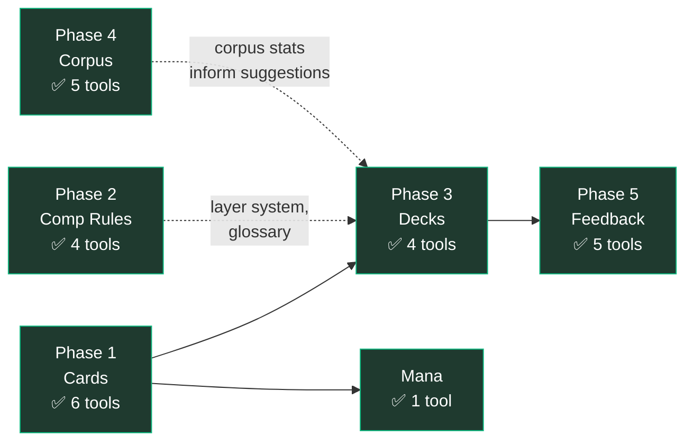

# Commander Collector MCP — Architecture Diagrams

Four diagrams covering the server end to end. All Mermaid — paste into anything that renders Mermaid (GitHub, VS Code, claude.ai canvas, Notion, Obsidian, Typora).

---

## 1. System layers

The server is a four-layer onion: tools at the edge, services in the middle, DB repos closest to storage, SQLite + external APIs at the bottom.

**Why the split.** Tools register with FastMCP and validate input. Services hold the math and parsing — no I/O, trivially unit-testable. Repos own the DB. The strict layering means each test can mock the layer below it.

---

## 2. Request flow — `analyze_deck`

What happens when the agent calls one of the deck tools. The cache-first resolver means a warm cache costs zero API calls; a cold cache costs ~2.

**Band selection logic.** All cards resolved → `HIGH`. Some unresolved → `MODERATE` with the missing names in `caveats`. Empty decklist → `UNKNOWN`.

---

## 3. Phase 5 feedback loop

User corrections become weight deltas that shape future synergy scoring. The loop is bounded — `update_weight` is a running mean clamped to [-1, +1], so no single bad day swings the score.

**Blend formula.** `alpha = n / (n + 4)`. At `n=0` (no feedback), the heuristic carries 100%. At `n=4`, learned weight is 50%. At `n=20`, learned weight is ~83%. The heuristic is the cold-start; feedback gradually takes over as evidence accumulates.

**Anti-pattern detection** uses the same `synergy_weight` table but reads in the opposite direction — pairs with `weight ≤ -0.25` and `sample_size ≥ 2` get flagged. That's how `identify_anti_patterns` knows what *not* to suggest.

---

## 4. Database schema

Nine tables across four concerns: card cache (1), decklist corpus (2), feedback loop (2), and Comprehensive Rules (4 incl. FTS5 mirrors).

**Two things worth flagging.**

*Canonical pair ordering.* `synergy_weight` has a `CHECK (card_a < card_b)` constraint so each unordered pair has exactly one row. The `canonical_pair()` helper in `learning/weights.py` sorts before any write. This is what makes "Sol Ring + Ramos" and "Ramos + Sol Ring" the same fact.

*FTS5 is denormalized on purpose.* `cr_rule_fts` and `cr_glossary_fts` are standalone virtual tables (not contentless) so they survive schema migrations cleanly. The ingest script repopulates them from `cr_rule` / `cr_glossary` at parse time.

---

## Phase status snapshot

**88 tests, 25 tools, 5 phases done.** Next is wiring the MCP into Commander Collector itself — either Streamable HTTP from the same Bluehost machine as the PHP API, or sidecar to the Next.js dev server.
